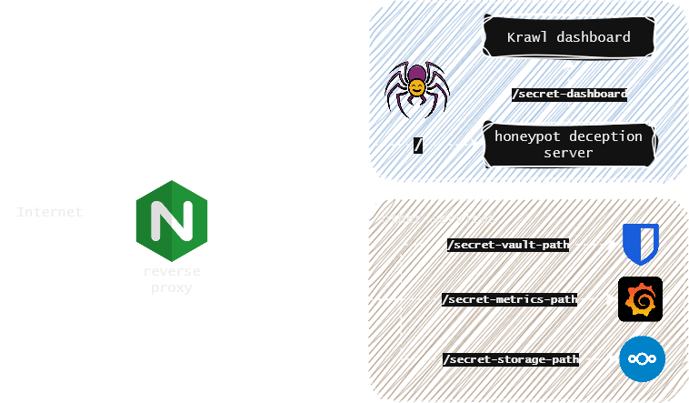

<h1 align="center">Krawl</h1>

<h3 align="center">
  <a name="readme-top"></a>
  
</h3>
<div align="center">

<p align="center">
  A modern, customizable web honeypot server designed to detect and track malicious activity from attackers and web crawlers through deceptive web pages, fake credentials, and canary tokens.
</p>

<div align="center">
  <a href="https://github.com/blessedrebus/krawl/blob/main/LICENSE">
    
  </a>
  <a href="https://github.com/blessedrebus/krawl/releases">
    
  </a>
</div>

<div align="center">
  <a href="https://ghcr.io/blessedrebus/krawl">
    
  </a>
  <a href="https://kubernetes.io/">
    
  </a>
  <a href="https://github.com/BlessedRebuS/Krawl/pkgs/container/krawl-chart">
    
  </a>
</div>
</div>

## Table of Contents
- [Demo](#demo)
- [What is Krawl?](#what-is-krawl)
- [Krawl Dashboard](#krawl-dashboard)
- [Installation](#-installation)
  - [Docker Run](#docker-run)
  - [Docker Compose](#docker-compose)
  - [Kubernetes](#kubernetes)
  - [Uvicorn (Python)](#uvicorn-python)
- [Configuration](#configuration)
  - [config.yaml](#configuration-via-configyaml)
  - [Environment Variables](#configuration-via-enviromental-variables)
- [Ban Malicious IPs](#use-krawl-to-ban-malicious-ips)
- [IP Reputation](#ip-reputation)
- [Forward Server Header](#forward-server-header)
- [Additional Documentation](#additional-documentation)
- [Contributing](#-contributing)

## Demo
Tip: crawl the `robots.txt` paths for additional fun
### Krawl URL: [http://demo.krawlme.com](http://demo.krawlme.com)
### View the dashboard [http://demo.krawlme.com/das_dashboard](http://demo.krawlme.com/das_dashboard)

## What is Krawl?

**Krawl** is a cloud‑native deception server designed to detect, delay, and analyze malicious attackers, web crawlers and automated scanners.

It creates realistic fake web applications filled with low‑hanging fruit such as admin panels, configuration files, and exposed fake credentials to attract and identify suspicious activity.


By wasting attacker resources, Krawl helps clearly distinguish malicious behavior from legitimate crawlers.

It features:

- **Spider Trap Pages**: Infinite random links to waste crawler resources based on the [spidertrap project](https://github.com/adhdproject/spidertrap)
- **Fake Login Pages**: WordPress, phpMyAdmin, admin panels
- **Honeypot Paths**: Advertised in robots.txt to catch scanners
- **Fake Credentials**: Realistic-looking usernames, passwords, API keys
- **[Canary Token](docs/canary-token.md) Integration**: External alert triggering
- **Random server headers**: Confuse attacks based on server header and version
- **Real-time Dashboard**: Monitor suspicious activity
- **Customizable Wordlists**: Easy JSON-based configuration
- **Random Error Injection**: Mimic real server behavior

You can easily expose Krawl alongside your other services to shield them from web crawlers and malicious users using a reverse proxy. For more details, see the [Reverse Proxy documentation](docs/reverse-proxy.md).



## Krawl Dashboard

Krawl provides a comprehensive dashboard, accessible at a **random secret path** generated at startup or at a **custom path** configured via `KRAWL_DASHBOARD_SECRET_PATH`. This keeps the dashboard hidden from attackers scanning your honeypot.

The dashboard is organized in three main tabs:

- **Overview** — High-level view of attack activity: an interactive map of IP origins, recent suspicious requests, and top IPs, User-Agents, and paths.


- **Attacks** — Detailed breakdown of captured credentials, honeypot triggers, and detected attack types (SQLi, XSS, path traversal, etc.) with charts and tables.


- **IP Insight** — In-depth forensic view of a selected IP: geolocation, ISP/ASN info, reputation flags, behavioral timeline, attack type distribution, and full access history.


For more details, see the [Dashboard documentation](docs/dashboard.md).


## 🚀 Installation

### Docker Run

Run Krawl with the latest image:

```bash
docker run -d \
  -p 5000:5000 \
  -e KRAWL_PORT=5000 \
  -e KRAWL_DELAY=100 \
  -e KRAWL_DASHBOARD_SECRET_PATH="/my-secret-dashboard" \
  -e KRAWL_DASHBOARD_PASSWORD="my-secret-password" \
  -v krawl-data:/app/data \
  --name krawl \
  ghcr.io/blessedrebus/krawl:latest
```

Access the server at `http://localhost:5000`

### Docker Compose

Create a `docker-compose.yaml` file:

```yaml
services:
  krawl:
    image: ghcr.io/blessedrebus/krawl:latest
    container_name: krawl-server
    ports:
      - "5000:5000"
    environment:
      - CONFIG_LOCATION=config.yaml
      - TZ=Europe/Rome
      # - KRAWL_DASHBOARD_SECRET_PATH="/my-secret-dashboard"
      # - KRAWL_DASHBOARD_PASSWORD=my-secret-password
    volumes:
      - ./config.yaml:/app/config.yaml:ro
      # bind mount for firewall exporters
      - ./exports:/app/exports
      - krawl-data:/app/data
    restart: unless-stopped

volumes:
  krawl-data:
```

Run with:

```bash
docker-compose up -d
```

Stop with:

```bash
docker-compose down
```

### Kubernetes
**Krawl is also available natively on Kubernetes**. Installation can be done either [via manifest](kubernetes/README.md) or [using the helm chart](helm/README.md).

### Uvicorn (Python)

Run Krawl directly with Python (suggested version 13) and uvicorn for local development or testing:

```bash
pip install -r requirements.txt
uvicorn app:app --host 0.0.0.0 --port 5000 --app-dir src
```

Access the server at `http://localhost:5000`


## Configuration
Krawl uses a **configuration hierarchy** in which **environment variables take precedence over the configuration file**. This approach is recommended for Docker deployments and quick out-of-the-box customization.

### Configuration via config.yaml
You can use the [config.yaml](config.yaml) file for advanced configurations, such as Docker Compose or Helm chart deployments.

### Configuration via Enviromental Variables

| Environment Variable | Description | Default |
|----------------------|-------------|---------|
| `CONFIG_LOCATION` | Path to yaml config file | `config.yaml` |
| `KRAWL_PORT` | Server listening port | `5000` |
| `KRAWL_DELAY` | Response delay in milliseconds | `100` |
| `KRAWL_SERVER_HEADER` | HTTP Server header for deception | `""` |
| `KRAWL_LINKS_LENGTH_RANGE` | Link length range as `min,max` | `5,15` |
| `KRAWL_LINKS_PER_PAGE_RANGE` | Links per page as `min,max` | `10,15` |
| `KRAWL_CHAR_SPACE` | Characters used for link generation | `abcdefgh...` |
| `KRAWL_MAX_COUNTER` | Initial counter value | `10` |
| `KRAWL_CANARY_TOKEN_URL` | External canary token URL | None |
| `KRAWL_CANARY_TOKEN_TRIES` | Requests before showing canary token | `10` |
| `KRAWL_DASHBOARD_SECRET_PATH` | Custom dashboard path | Auto-generated |
| `KRAWL_DASHBOARD_PASSWORD` | Password for protected dashboard panels | Auto-generated |
| `KRAWL_PROBABILITY_ERROR_CODES` | Error response probability (0-100%) | `0` |
| `KRAWL_DATABASE_PATH` | Database file location | `data/krawl.db` |
| `KRAWL_EXPORTS_PATH` | Path where firewalls rule sets are exported | `exports` |
| `KRAWL_BACKUPS_PATH` | Path where database dump are saved | `backups` |
| `KRAWL_BACKUPS_CRON` | cron expression to control backup job schedule | `*/30 * * * *` |
| `KRAWL_BACKUPS_ENABLED` | Boolean to enable db dump job | `true` |
| `KRAWL_DATABASE_RETENTION_DAYS` | Days to retain data in database | `30` |
| `KRAWL_HTTP_RISKY_METHODS_THRESHOLD` | Threshold for risky HTTP methods detection | `0.1` |
| `KRAWL_VIOLATED_ROBOTS_THRESHOLD` | Threshold for robots.txt violations | `0.1` |
| `KRAWL_UNEVEN_REQUEST_TIMING_THRESHOLD` | Coefficient of variation threshold for timing | `0.5` |
| `KRAWL_UNEVEN_REQUEST_TIMING_TIME_WINDOW_SECONDS` | Time window for request timing analysis in seconds | `300` |
| `KRAWL_USER_AGENTS_USED_THRESHOLD` | Threshold for detecting multiple user agents | `2` |
| `KRAWL_ATTACK_URLS_THRESHOLD` | Threshold for attack URL detection | `1` |
| `KRAWL_INFINITE_PAGES_FOR_MALICIOUS` | Serve infinite pages to malicious IPs | `true` |
| `KRAWL_MAX_PAGES_LIMIT` | Maximum page limit for crawlers | `250` |
| `KRAWL_BAN_DURATION_SECONDS` | Ban duration in seconds for rate-limited IPs | `600` |

For example

```bash
# Set canary token
export CONFIG_LOCATION="config.yaml"
export KRAWL_CANARY_TOKEN_URL="http://your-canary-token-url"

# Set number of pages range (min,max format)
export KRAWL_LINKS_PER_PAGE_RANGE="5,25"

# Set analyzer thresholds
export KRAWL_HTTP_RISKY_METHODS_THRESHOLD="0.2"
export KRAWL_VIOLATED_ROBOTS_THRESHOLD="0.15"

# Set custom dashboard path and password
export KRAWL_DASHBOARD_SECRET_PATH="/my-secret-dashboard"
export KRAWL_DASHBOARD_PASSWORD="my-secret-password"
```

Example of a Docker run with env variables:

```bash
docker run -d \
  -p 5000:5000 \
  -e KRAWL_PORT=5000 \
  -e KRAWL_DELAY=100 \
  -e KRAWL_DASHBOARD_PASSWORD="my-secret-password" \
  -e KRAWL_CANARY_TOKEN_URL="http://your-canary-token-url" \
  --name krawl \
  ghcr.io/blessedrebus/krawl:latest
```

## Use Krawl to Ban Malicious IPs
Krawl uses a reputation-based system to classify attacker IP addresses. Every five minutes, Krawl exports the identified malicious IPs to a `malicious_ips.txt` file.

This file can either be mounted from the Docker container into another system or downloaded directly via `curl`:

```bash
curl https://your-krawl-instance/<DASHBOARD-PATH>/api/download/malicious_ips.txt
```

This file enables automatic blocking of malicious traffic across various platforms. You can use it to update firewall rules on:
* [OPNsense and pfSense](https://www.allthingstech.ch/using-opnsense-and-ip-blocklists-to-block-malicious-traffic)
* [RouterOS](https://rentry.co/krawl-routeros)
* [IPtables](plugins/iptables/README.md) and [Nftables](plugins/nftables/README.md)
* [Fail2Ban](plugins/fail2ban/README.md)

## IP Reputation
Krawl [uses tasks that analyze recent traffic to build and continuously update an IP reputation](src/tasks/analyze_ips.py) score. It runs periodically and evaluates each active IP address based on multiple behavioral indicators to classify it as an attacker, crawler, or regular user. Thresholds are fully customizable.


The analysis includes:
- **Risky HTTP methods usage** (e.g. POST, PUT, DELETE ratios)
- **Robots.txt violations**
- **Request timing anomalies** (bursty or irregular patterns)
- **User-Agent consistency**
- **Attack URL detection** (e.g. SQL injection, XSS patterns)

Each signal contributes to a weighted scoring model that assigns a reputation category:
- `attacker`
- `bad_crawler`
- `good_crawler`
- `regular_user`
- `unknown` (for insufficient data)

The resulting scores and metrics are stored in the database and used by Krawl to drive dashboards, reputation tracking, and automated mitigation actions such as IP banning or firewall integration.

## Forward server header
If Krawl is deployed behind a proxy such as NGINX the **server header** should be forwarded using the following configuration in your proxy:

```bash
location / {
    proxy_pass https://your-krawl-instance;
    proxy_pass_header Server;
}
```

## Additional Documentation

| Topic | Description |
|-------|-------------|
| [API](docs/api.md) | External APIs used by Krawl for IP data, reputation, and geolocation |
| [Honeypot](docs/honeypot.md) | Full overview of honeypot pages: fake logins, directory listings, credential files, SQLi/XSS/XXE/command injection traps, and more |
| [Reverse Proxy](docs/reverse-proxy.md) | How to deploy Krawl behind NGINX or use decoy subdomains |
| [Database Backups](docs/backups.md) | Enable and configure the automatic database dump job |
| [Canary Token](docs/canary-token.md) | Set up external alert triggers via canarytokens.org |
| [Wordlist](docs/wordlist.md) | Customize fake usernames, passwords, and directory listings |
| [Dashboard](docs/dashboard.md) | Access and explore the real-time monitoring dashboard |

## 🤝 Contributing

Contributions welcome! Please:
1. Fork the repository
2. Create a feature branch
3. Make your changes
4. Submit a pull request (explain the changes!)


## Disclaimer
> [!CAUTION]
> This is a deception/honeypot system. Deploy in isolated environments and monitor carefully for security events. Use responsibly and in compliance with applicable laws and regulations.

## Star History
