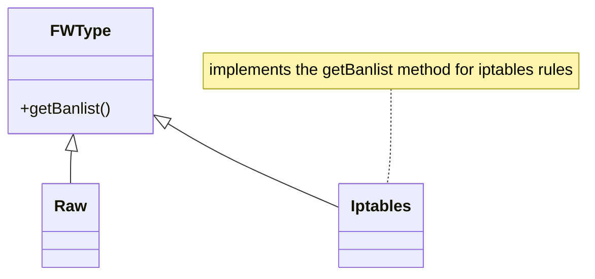

# Firewall exporters documentation

Firewall export feature is implemented trough a strategy pattern with an abstract class and a series of subclasses that implement the specific export logic for each firewall specific system:



Rule sets are generated trough the `top_attacking_ips__export-malicious-ips` that writes down the files in the `exports_path` configuration path. Files are named after the specific firewall that they implement as `[firewall]_banlist.txt` except for raw file that is called `malicious_ips.txt` to support legacy

## Adding firewalls exporters

To add a firewall exporter create a new python class in `src/firewall` that implements `FWType` class

> example with `Yourfirewall` class in the `yourfirewall.py` file
```python
from typing_extensions import override
from firewall.fwtype import FWType

class Yourfirewall(FWType):

    @override
    def getBanlist(self, ips) -> str:
        """
        Generate raw list of bad IP addresses.

        Args:
            ips: List of IP addresses to ban

        Returns:
            String containing raw ips, one per line
        """
        if not ips:
            return ""
        # Add here code implementation
```

Then add the following to the `src/server.py` and `src/tasks/top_attacking_ips.py`

```python
from firewall.yourfirewall import Yourfirewall
```
